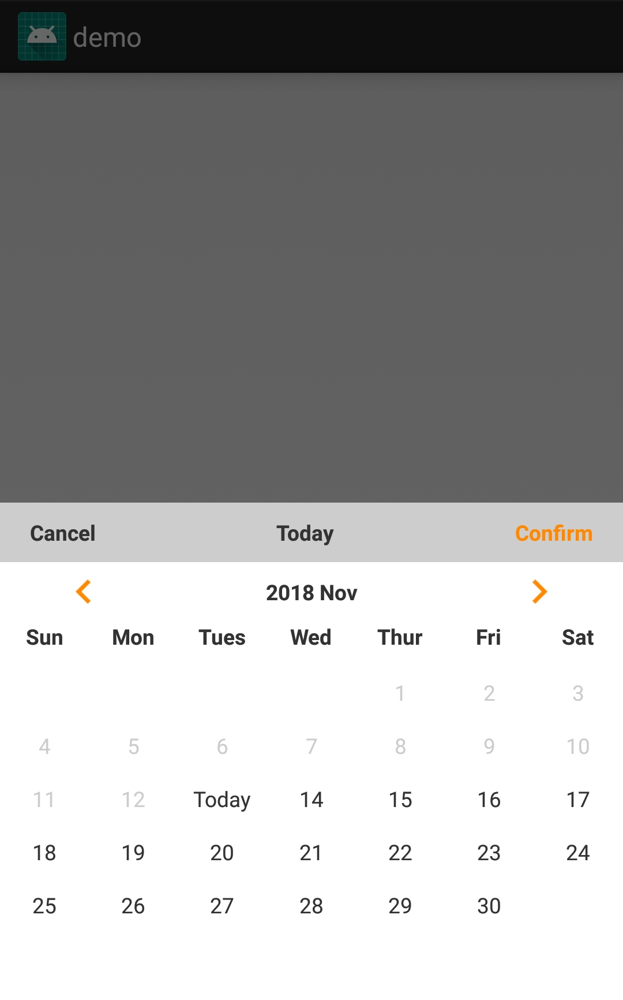
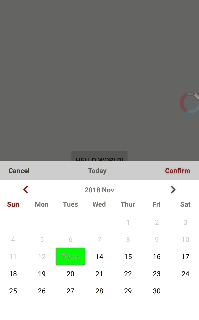

# Android_Datepicker
An IOS style DatePicker.

## Step 1. Add the JitPack repository to your build file

Add it in your root build.gradle at the end of repositories:
```java
	allprojects {
		repositories {
			...
			maven { url 'https://jitpack.io' }
		}
	}
```

## Step 2. Add the dependency
```java
dependencies {
	        implementation 'com.github.oOJohn6Oo:Android_Datepicker:0.1'
	}
```
## Step 3. Use it

- simple example
``` java
        findViewById(R.id.btn).setOnClickListener(view ->{
            new DatePicker(this).show();
        });
```



- custom example
``` java
        btn.setOnClickListener(view -> {
            DatePicker datePicker = new DatePicker(MainActivity.this);

            datePicker.setOnCancelClickListener(view1 -> datePicker.dismiss())
                    //“确定”的点击事件
                    .setOnConfirmClickListener(view12 -> {
                        Toast.makeText(MainActivity.this, datePicker.getSelectedYear()+" "+
                                datePicker.getSelectedMonth()+" "+
                                datePicker.getSelectedDay(), Toast.LENGTH_SHORT).show();
                        datePicker.dismiss();})
                    //“取消”、“确定”的文字颜色
                    .setColorConfirm(Color.RED)
                    .setColorCancel(Color.DKGRAY)

                    //选择“时间”的显示样式
                    .setDateShowStyle(DatePicker.DATE_SHOW_STYLE_3)

                    // 左右箭头颜色
                    .setColorLeftArrow(Color.RED)
                    .setColorRightArrow(Color.RED)

                    //星期的颜色
                    .setColorWeeks(DatePicker.SUNDAY,Color.RED)

                    //“今天”以前、今天、“今天”以后 的显示文字颜色
                    .setColorFontBeforeToday(Color.LTGRAY)
                    .setColorFontToday(Color.WHITE)
                    .setColorFontAfterToday(Color.BLACK)

                    //“今天”的背景颜色
                    .setColorBgdToday(Color.GREEN)
                    //选中日期的文字颜色和背景颜色
                    .setColorFontSelectedDay(Color.WHITE)
                    .setColorBgdSelectedDay(Color.RED)
                    .show();
        });
```

